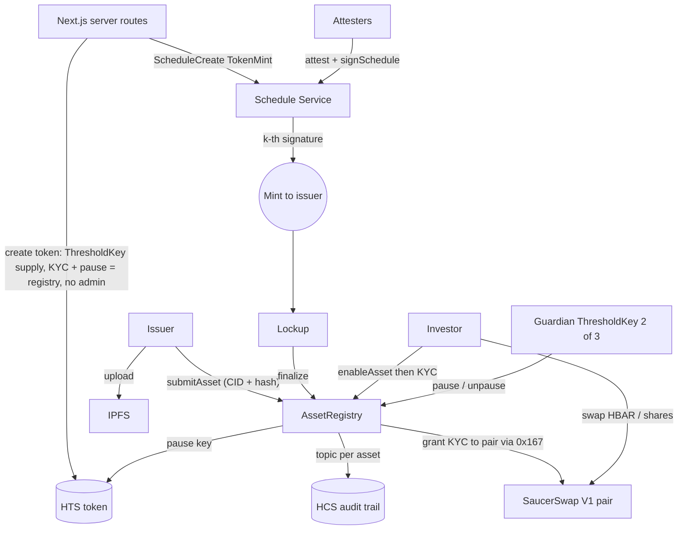

# Attestly

**Attested real-world assets on Hedera.** A scaffold-hbar template for issuing a real-world-asset
token that **the network itself refuses to mint** until a quorum of independent attesters approves —
then trading it on a **KYC-gated SaucerSwap pool** where only verified accounts can hold the token.
Every step is written to a per-asset HCS audit trail and linked to HashScan.

```bash
npm create scaffold-hbar@latest -- --template abaresks24/attestly
```

> Built for the Scaffold-HBAR Template Bounty. MIT licensed. **Testnet demo — the token carries no
> legal title to any asset** (see [Disclaimer](#disclaimer)).

---

## Problem

Tokenizing an asset takes an afternoon. Making issuance _trustworthy_ and the token _tradable
without breaking compliance_ takes weeks — and there is no forkable reference on Hedera that shows
how native keys, scheduled transactions and a DEX fit together. This template is that reference.

It gives you three patterns every RWA project needs, working together and each usable on its own:

1. **Quorum-gated issuance.** The token's supply key is a native `ThresholdKey(k of n)` of attester
   keys. A scheduled `TokenMint` executes only when _k_ attesters sign. No Solidity enforces this —
   the network does.
2. **Permissioned token on a public AMM.** The token's KYC key is held by a contract. Only verified
   accounts (plus the AMM pair) can hold it; everyone else is refused at the protocol level.
3. **Audit trail.** Submission, each attestation with its evidence hash, mint, lockup, pause — all
   logged to an HCS topic per asset.

## 60-second quickstart

```bash
git clone https://github.com/abaresks24/attestly && cd attestly
yarn install

# 1. Fund a testnet operator at https://portal.hedera.com (ECDSA), then:
cp .env.example packages/nextjs/.env.local      # set OPERATOR_ID / OPERATOR_KEY
cp .env.example packages/hardhat/.env           # set the deployer key

# 2. Deploy the registries and seed the demo committee (issuer, 3 attesters,
#    guardian 2-of-3, 2 investors) — writes gitignored .demo-keys.json:
yarn deploy:testnet
yarn seed:demo

# 3. Run the app and follow "Run the full story" on the home page:
yarn next:dev                                   # http://localhost:3000
```

No operator set? The app still boots — every route returns 200 and the pages explain what to
configure. You just can't perform on-chain actions until the operator is present.

## Prerequisites

- **Node ≥ 20.18.3** and **Yarn 3** (this repo uses Yarn workspaces; the CLI can also scaffold npm apps).
- A funded **Hedera testnet** account from [portal.hedera.com](https://portal.hedera.com) — **ECDSA
  secp256k1** (required for HIP-755 wallet signing).
- Optional: an **IPFS pinning** JWT (Pinata-style). Without it the demo stores the document locally
  behind a labeled CID.

## Environment

Copy `.env.example` into the two package env files. The app boots with none of these set.

| Variable | Where | Purpose |
|---|---|---|
| `OPERATOR_ID` | `packages/nextjs/.env.local` | Testnet account id (`0.0.x`) for server-side native ops (token create, HCS, schedules) |
| `OPERATOR_KEY` | `packages/nextjs/.env.local` | Operator private key (`0x…`) |
| `OPERATOR_KEY_TYPE` | `packages/nextjs/.env.local` | `ECDSA` (default) or `ED25519` |
| deployer key | `packages/hardhat/.env` | Managed by `yarn hardhat:account:*`; used by `yarn deploy:testnet` |
| `IPFS_PINNING_JWT` | `packages/nextjs/.env.local` | Optional pinning provider; falls back to a labeled local store |
| `NEXT_PUBLIC_WALLETCONNECT_PROJECT_ID` | `packages/nextjs/.env.local` | Wallet mode (optional in demo mode) |
| `ASSET_REGISTRY_EVM` / `INVESTOR_REGISTRY_EVM` | env | Override the default deployed addresses after a fresh deploy |

## Architecture



- **`AssetRegistry`** holds the KYC and pause keys of every issued token, tracks assets,
  attestations, lockup and finalization, and grants KYC through the HTS system contract (`0x167`).
- **`InvestorRegistry`** records admin-approved investors (off-chain KYC assumed).
- **Server routes** perform the native HAPI operations an EVM wallet cannot sign: token creation with
  a threshold key, HCS topics/messages, scheduled mint, demo account creation.
- **`packages/hedera`** is the shared, typed helper layer (client, mirror node, keys, schedules,
  SaucerSwap, error mapping, attester adapters).

Full detail in [docs/ARCHITECTURE.md](docs/ARCHITECTURE.md). Adapt it in [docs/ADAPTING.md](docs/ADAPTING.md).

## Why Hedera

| Need | Hedera mechanism |
|---|---|
| No issuance without a quorum | HTS supply key = native `ThresholdKey` |
| Approvals collected asynchronously | Schedule Service, long-term expiry (HIP-423) |
| Attesters sign from an EVM wallet | HIP-755 `signSchedule()` on `0x16b` |
| Compliance on every transfer, on any venue | HTS KYC key held by a contract |
| Emergency stop | HTS pause key |
| Multisig guardian without a multisig contract | Account key = native `ThresholdKey(2/3)` |
| Keys nobody can change later | Token created with **no admin key** |
| Public audit trail | HCS topic per asset |

## Who are the attesters?

An attester is whoever a market already trusts to vouch for the asset. They hold one of the _n_
supply-key shares; _k_ of them signing is what lets the network mint. Swap the demo adapters
(`ManualAttester`, `MockRegistryAttester`) for the real signer of your domain — one file, see
[ADAPTING.md](docs/ADAPTING.md).

| Asset type | Who signs (the attesters) | What the token represents |
|---|---|---|
| Stablecoin reserves | Reserve auditors / attestation firm | A claim on the audited reserve |
| Bonds | Bond trustee / paying agent | Bond units |
| Fund shares | Fund administrator / transfer agent | Fund share-class units |
| Carbon credits | Accredited verification body (Verra, Gold Standard) | Tonnes of CO₂e issued/retired |
| Warehouse receipts | Warehouse operator + independent inspector | Receipt for stored goods |
| Startup equity | Cap-table administrator / company secretary | Share-class units |
| Invoices | Auditor / factoring agent | A claim on the invoice cash flow |
| Art | Appraiser + custodian | Fractional ownership of the work |

## Rubric mapping

| Criterion | Points | Evidence |
|---|---|---|
| Ecosystem | 35 | SaucerSwap is the holder exit; IPFS holds the attested document. |
| Docs | 30 | This README, [AGENTS.md](AGENTS.md), [ARCHITECTURE](docs/ARCHITECTURE.md), [ADAPTING](docs/ADAPTING.md), [TESTNET_VERIFICATION](docs/TESTNET_VERIFICATION.md). |
| Code | 20 | Small typed monorepo, one contract per concern, tested contracts + adapters, graceful degradation. |
| Hedera depth | 15 | Threshold supply key, KYC, pause, no admin key; HSS long-term schedules + HIP-755; HCS; threshold account key; mirror node. |

## Trust assumptions

This template makes its trust boundaries explicit so you can decide what to harden for production:

- **Attesters are honest-majority.** _k of n_ signatures mint the token; a colluding _k_ can mint
  against a bad asset. Raise the threshold, diversify the committee, and see
  [PROTOCOL_VISION.md](docs/PROTOCOL_VISION.md) for staking/slashing that puts capital at risk.
- **KYC is off-chain.** `InvestorRegistry` records an admin's approval decision; the actual identity
  check happens off-chain. The chain enforces the _consequence_ (only KYC-granted accounts hold the
  token), not the check itself.
- **The document ↔ asset link is social.** The chain proves _which_ document (CID + SHA-256) the
  attesters signed; it cannot prove the document is true. That is what the attesters are for.
- **Demo mode holds keys server-side.** `yarn seed:demo` writes actor keys to a gitignored
  `.demo-keys.json` so the app can act as issuer/attester/guardian for a one-machine walkthrough.
  The `/api/assets/**` server routes are **intentionally unauthenticated demo endpoints** — any caller
  who can reach the server picks which seeded actor to sign as. Run them only locally/on testnet;
  **never expose the app publicly or point it at mainnet.** Production uses wallet mode (RainbowKit +
  HIP-755) with no private keys on the server. The on-chain invariants (KYC gating, quorum mint,
  guardian threshold) hold regardless of who calls the routes — the network enforces them.
- **Venue is SaucerSwap V1 on testnet.** V2 pool creation is blocked on testnet by a misconfigured
  `poolCreateFee`; the venue is a config seam (`packages/hedera/src/constants.ts`). See
  [BUILD_PLAN.md](docs/BUILD_PLAN.md) G1.

## Disclaimer

This is a **testnet template for education and prototyping**. The tokens it mints **carry no legal
title, ownership, or claim** to any real-world asset. Nothing here is financial, legal, or investment
advice. Do not deploy to mainnet with real assets without independent legal and security review.

## Going further

The staking-and-slashing economics that would make attesters _accountable_ (bonded attesters,
whistleblower rewards, random committee draw via the PRNG precompile, jurisdiction pools, registry
oracles with periodic re-checks, a victims fund) are deliberately **out of scope** for this template
and sketched in [docs/PROTOCOL_VISION.md](docs/PROTOCOL_VISION.md).

## For agents

Coding-agent briefing (repo map, commands, invariants, how to add an attester/parameter/asset type):
[AGENTS.md](AGENTS.md).

## License

MIT — see [LICENSE](LICENSE). Built on the [scaffold-hbar](https://github.com/hedera-dev/create-scaffold-hbar)
base (© hedera-dev), itself derived from Scaffold-ETH 2 (© BuidlGuidl), both MIT.
